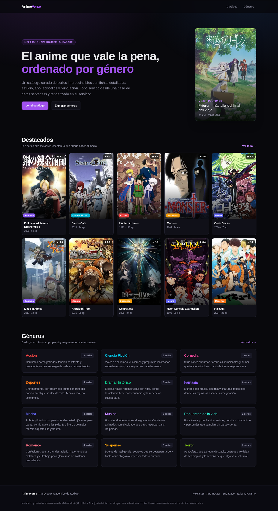
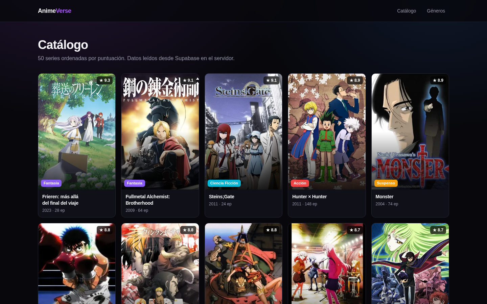
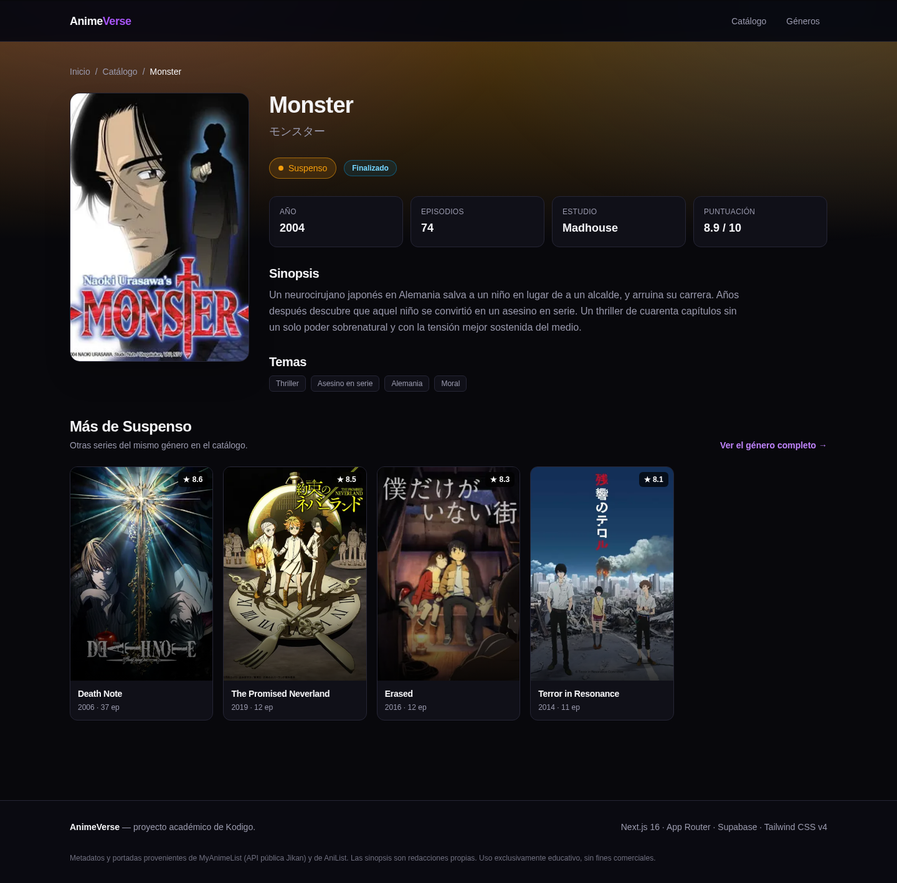
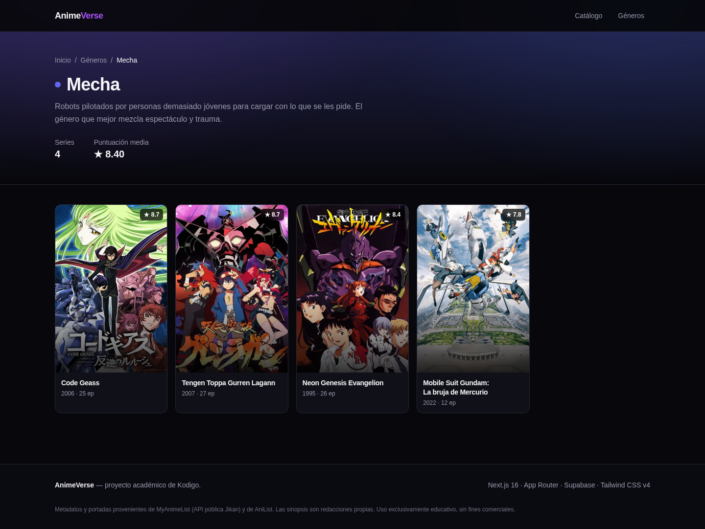
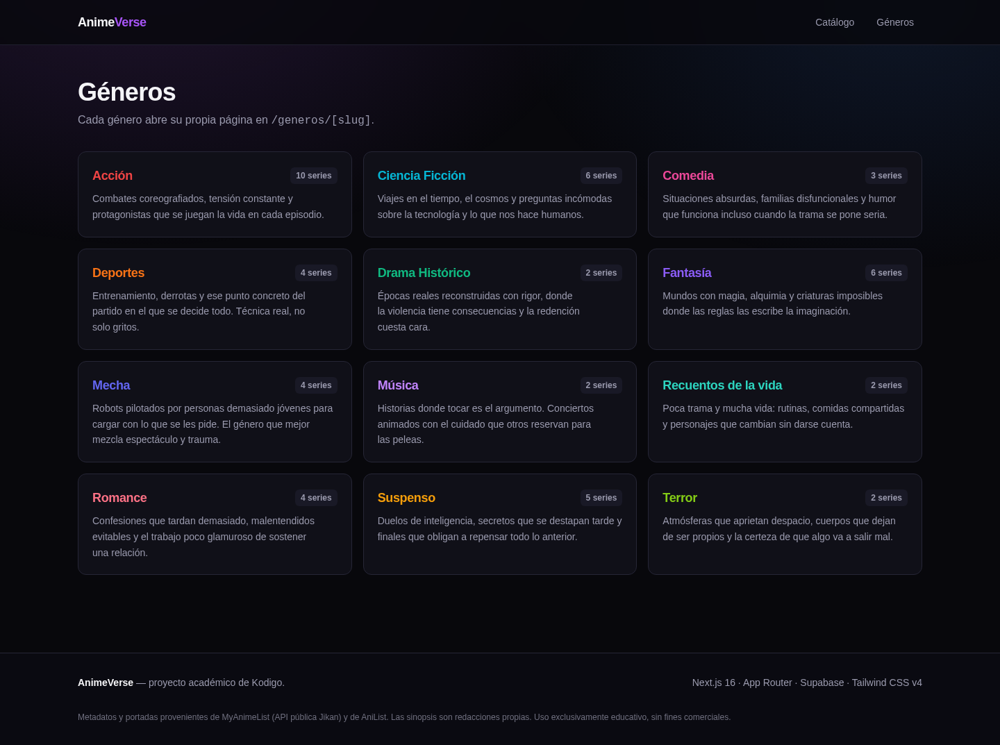
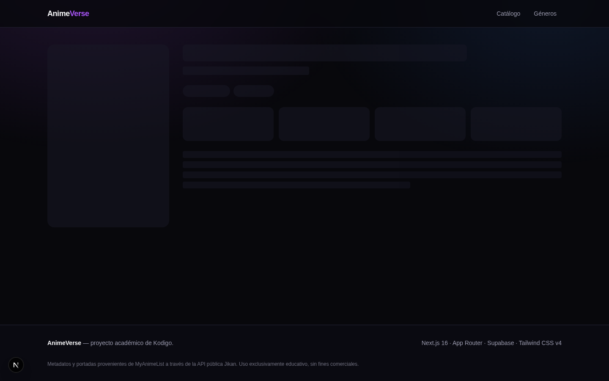
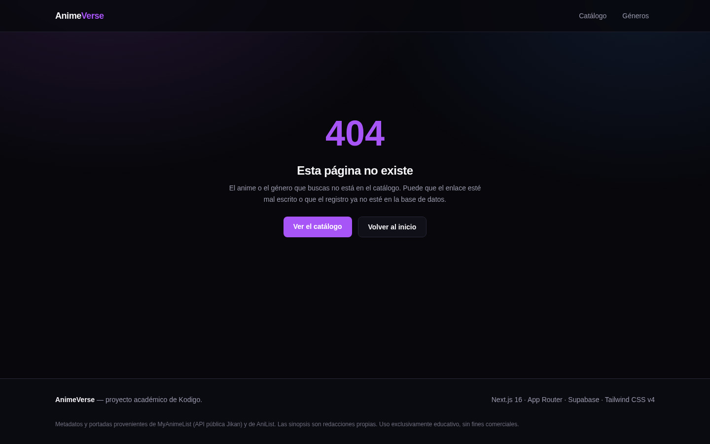
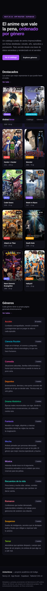
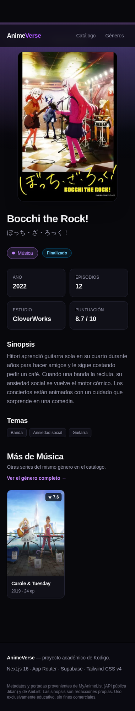

# AnimeVerse

Landing page y catálogo de anime construido con **Next.js 16 (App Router)** y **Supabase** como base de datos serverless. Todo el contenido —series, géneros, puntuaciones— se lee desde Postgres en **Server Components**, así que el navegador recibe HTML ya renderizado, sin spinners ni peticiones desde el cliente.

> Proyecto académico de Kodigo — actividad *"Dominio del App Router y Gestión de Datos: Construcción de Rutas Dinámicas y Persistencia con servicio serverless"*.

**Demo en producción:** <https://anime-verse-olive-tau.vercel.app>

---

## Índice

- [Funcionalidades](#funcionalidades)
- [Stack](#stack)
- [Capturas de pantalla](#capturas-de-pantalla)
- [Estructura del proyecto](#estructura-del-proyecto)
- [Instalación local](#instalación-local)
- [Variables de entorno](#variables-de-entorno)
- [Base de datos y RLS](#base-de-datos-y-rls)
- [Decisiones técnicas](#decisiones-técnicas)
- [Despliegue en Vercel](#despliegue-en-vercel)

---

## Funcionalidades

### Rutas

| Ruta | Tipo | Qué hace |
|---|---|---|
| `/` | Estática (ISR) | Landing: hero, series destacadas y todos los géneros. |
| `/animes` | Estática (ISR) | Catálogo completo ordenado por puntuación. |
| `/animes/[slug]` | **Dinámica** | Ficha de un anime: portada, ficha técnica, sinopsis, temas y series relacionadas. |
| `/generos` | Estática (ISR) | Índice de géneros con el número de series de cada uno. |
| `/generos/[slug]` | **Dinámica** | Todas las series de un género, con su color de acento y puntuación media. |

Las dos rutas dinámicas se enlazan entre sí: desde la ficha de un anime se llega a su género, y desde el género se vuelve a cualquier otra serie.

### Detalles de implementación

- **Server Components en toda la app.** El único Client Component es `PosterImage`, y existe por una razón concreta: reaccionar a una portada rota (`onError`) mostrando un degradado con las iniciales del título en lugar de un hueco vacío. Nada más necesita ejecutarse en el navegador.
- **Prerenderizado con `generateStaticParams`.** Ambas rutas dinámicas generan sus páginas en tiempo de build, una por cada registro de la base de datos. Con `revalidate = 3600` se regeneran en segundo plano cada hora (ISR), y como `dynamicParams` sigue en `true`, un registro nuevo añadido a Supabase después del despliegue se genera bajo demanda en su primera visita.
- **Loading states reales.** Cada segmento tiene su `loading.tsx` con esqueletos que imitan la geometría del contenido final (proporción 2:3 de la portada, dos líneas de título), de modo que no hay salto de layout al llegar los datos.
- **Manejo de errores en tres capas:** `error.tsx` por segmento con botón de reintento (`reset()`), `not-found.tsx` para slugs inexistentes vía `notFound()`, y validación temprana de las variables de entorno que falla con un mensaje que dice qué hacer en lugar del críptico `supabaseUrl is required`.
- **Metadatos dinámicos.** `generateMetadata` produce título, descripción y Open Graph propios de cada anime y cada género.
- **Consultas en paralelo.** Donde dos lecturas son independientes se lanzan con `Promise.all` en vez de encadenar dos `await`.
- **Diseño responsive y accesible.** Mobile-first, grid de 2 a 5 columnas, enlace "saltar al contenido", foco visible en todos los controles y respeto por `prefers-reduced-motion`.

---

## Stack

| Pieza | Versión | Rol |
|---|---|---|
| [Next.js](https://nextjs.org) | 16.3.4 | Framework, App Router, Turbopack |
| [React](https://react.dev) | 19.2 | Server y Client Components |
| [Supabase](https://supabase.com) | `@supabase/supabase-js` 2.x | Postgres serverless + RLS |
| [Tailwind CSS](https://tailwindcss.com) | 4.x | Estilos, tokens con `@theme` |
| TypeScript | 5.x | Tipado estricto |

Requiere **Node.js 20.9 o superior** (mínimo exigido por Next.js 16).

---

## Capturas de pantalla

### Landing page

Hero, once series destacadas y los doce géneros, todo leído desde Supabase en el servidor.



### Catálogo completo — `/animes`

Las 50 series ordenadas por puntuación, con su género y datos reales.



### Ruta dinámica 1 — `/animes/[slug]`

Ficha de detalle: portada, ficha técnica, sinopsis, temas y series del mismo género.



### Ruta dinámica 2 — `/generos/[slug]`

Listado de un género, teñido con su color y con la puntuación media calculada.



### Índice de géneros — `/generos`

Los doce géneros con el número de series de cada uno.



### Loading state

`loading.tsx` del segmento `[slug]`: el esqueleto imita la geometría real de la ficha
(portada 2:3, título, insignias, cuatro tarjetas de datos y la sinopsis), así que no hay
salto de layout cuando llegan los datos.



### Manejo de errores — 404

Un slug inexistente devuelve un **404 real** (código HTTP 404, no un soft 404) con la
página personalizada.



### Diseño responsive (390 px)





---

## Estructura del proyecto

```
anime-verse/
├── supabase/
│   ├── schema.sql              # Tablas, índices y políticas RLS
│   └── seed.sql                # 12 géneros + 50 animes de ejemplo
├── src/
│   ├── app/
│   │   ├── layout.tsx          # Shell, fuentes y metadatos base
│   │   ├── page.tsx            # Landing
│   │   ├── loading.tsx         # ┐
│   │   ├── error.tsx           # ├ estados globales
│   │   ├── not-found.tsx       # ┘
│   │   ├── animes/
│   │   │   ├── page.tsx            # Catálogo
│   │   │   └── [slug]/             # ── RUTA DINÁMICA 1 ──
│   │   │       ├── page.tsx
│   │   │       ├── loading.tsx
│   │   │       └── error.tsx
│   │   └── generos/
│   │       ├── page.tsx            # Índice de géneros
│   │       └── [slug]/             # ── RUTA DINÁMICA 2 ──
│   │           ├── page.tsx
│   │           ├── loading.tsx
│   │           └── error.tsx
│   ├── components/             # UI reutilizable + esqueletos de carga
│   ├── lib/
│   │   ├── env.ts              # Validación de variables de entorno
│   │   ├── queries.ts          # Todas las consultas a Supabase, tipadas
│   │   └── supabase/server.ts  # Cliente de Supabase (server-only)
│   └── types/database.ts       # Tipos que reflejan el esquema SQL
├── .env.example                # Plantilla de variables (sin credenciales)
└── next.config.ts              # remotePatterns para las portadas remotas
```

---

## Instalación local

### 1. Clonar e instalar dependencias

```bash
git clone https://github.com/InfinityJaaR/anime-verse.git
cd anime-verse
npm install
```

### 2. Crear el proyecto de Supabase

1. Entra a [supabase.com](https://supabase.com) y crea un proyecto nuevo (el plan gratuito basta).
2. Abre **SQL Editor → New query**, pega el contenido de [`supabase/schema.sql`](./supabase/schema.sql) y pulsa **Run**. Esto crea las tablas `generos` y `animes` con sus políticas RLS.
3. Abre otra query, pega [`supabase/seed.sql`](./supabase/seed.sql) y ejecútala. Inserta 12 géneros y 50 animes.

Ambos scripts son idempotentes: se pueden volver a ejecutar sin duplicar datos ni provocar errores.

### 3. Configurar las variables de entorno

```bash
cp .env.example .env.local
```

Rellena `.env.local` con los valores de **Project Settings → API** de tu proyecto de Supabase.

### 4. Levantar la aplicación

```bash
npm run dev      # servidor de desarrollo en http://localhost:3000
npm run build    # build de producción
npm run start    # sirve el build de producción
npm run lint     # ESLint
```

---

## Variables de entorno

| Variable | Obligatoria | Descripción | Dónde obtenerla |
|---|:---:|---|---|
| `NEXT_PUBLIC_SUPABASE_URL` | Sí | URL del proyecto, con formato `https://<id>.supabase.co` | Supabase → Project Settings → API → *Project URL* |
| `NEXT_PUBLIC_SUPABASE_ANON_KEY` | Sí | Clave pública (`anon` / `publishable`) | Supabase → Project Settings → API → *Project API keys* |

La plantilla está en [`.env.example`](./.env.example). El archivo real, `.env.local`, está en `.gitignore` y **nunca** se sube al repositorio.

> **¿Es seguro exponer la anon key en el navegador?**
> Sí, siempre que las tablas tengan RLS activo — que es exactamente el caso aquí. Esa clave solo puede hacer lo que las políticas permitan, y en este proyecto las políticas solo permiten `SELECT`. Lo que **nunca** debe salir del servidor es la `service_role` key, porque ignora RLS por completo.

---

## Base de datos y RLS

### Esquema

Relación 1:N — un género agrupa muchos animes:

```
generos                              animes
├── id           bigint PK           ├── id             bigint PK
├── slug         text UNIQUE  ◄──┐   ├── slug           text UNIQUE
├── nombre       text             │   ├── titulo         text
├── descripcion  text             │   ├── titulo_japones text
└── color        text (hex)       │   ├── sinopsis       text
                                  │   ├── imagen_url     text
                                  │   ├── anio           smallint
                                  │   ├── episodios      smallint
                                  │   ├── estado         text
                                  │   ├── estudio        text
                                  │   ├── puntuacion     numeric(3,1)
                                  │   ├── destacado      boolean
                                  │   ├── tags           text[]
                                  └───┼── genero_id      bigint FK
                                      └── created_at     timestamptz
```

El esquema incluye restricciones `CHECK` sobre el formato de los slugs, el rango de la puntuación, el año y los valores válidos de `estado`, más índices sobre `genero_id`, `destacado` y `puntuacion`.

### Row Level Security

RLS está **habilitado en ambas tablas**, con una única política por tabla:

```sql
alter table public.animes enable row level security;

create policy "Lectura publica de animes"
  on public.animes
  for select
  to anon, authenticated
  using (true);
```

Al no existir políticas de `INSERT`, `UPDATE` ni `DELETE`, Postgres rechaza cualquier escritura hecha con la clave pública. En la práctica: la base es de **solo lectura** para el frontend, que es justo lo que necesita un catálogo público.

---

## Decisiones técnicas

**`@supabase/supabase-js` en lugar de `@supabase/ssr`.**
`@supabase/ssr` existe para sincronizar la sesión del usuario mediante cookies. Esta aplicación no tiene autenticación: todas las lecturas son públicas y anónimas. Usar el cliente normal evita tocar cookies y, por tanto, permite que Next.js prerenderice las páginas de forma estática. En cuanto una página lee cookies, Next.js la marca como dinámica y `generateStaticParams` deja de aportar nada.

**`import "server-only"` en la capa de datos.**
Tanto `lib/supabase/server.ts` como `lib/queries.ts` lo importan. Si algún día alguien intenta usar una consulta desde un Client Component, el error salta en tiempo de compilación en vez de filtrar la lógica de acceso a datos al bundle del navegador.

**Tipos escritos a mano en lugar de generados con la CLI.**
`src/types/database.ts` refleja el esquema manualmente. Así el repositorio se clona y compila sin necesidad de credenciales ni de un paso de generación previo — importante para un proyecto que otra persona va a revisar.

**`dynamicParams = false` en las rutas dinámicas.**
Ambos segmentos tienen `loading.tsx`, lo que envuelve la página en un Suspense y activa el
streaming de la respuesta. Una vez enviados los headers —con status 200— `notFound()` ya no
puede cambiarlos: se obtendría un *soft 404*, la página correcta pero con código 200. Como
todos los slugs válidos salen de `generateStaticParams`, cerrar la lista en build hace que
Next.js responda un 404 real antes de empezar a renderizar. El precio es que un anime nuevo
en Supabase necesita un build para ser accesible, un compromiso razonable para un catálogo
curado.

**Portadas remotas con plan B.**
Las imágenes vienen de los CDN públicos de MyAnimeList y AniList, ambos declarados en `remotePatterns` de `next.config.ts` (`images.domains` quedó obsoleto en Next.js 16). Que hagan falta dos no fue una decisión de diseño: MyAnimeList se cayó a mitad de la carga de datos y las series restantes se obtuvieron de AniList. Precisamente porque depender de un CDN externo es frágil, `PosterImage` captura el `onError` y dibuja un degradado con el color del género y las iniciales del título.

---

## Despliegue en Vercel

```bash
npm i -g vercel
vercel login
vercel link
```

Configura las dos variables de entorno en los tres entornos:

```bash
vercel env add NEXT_PUBLIC_SUPABASE_URL production
vercel env add NEXT_PUBLIC_SUPABASE_ANON_KEY production
# repetir para: preview, development
```

También pueden añadirse desde **Vercel Dashboard → Project → Settings → Environment Variables**.

Desplegar:

```bash
vercel --prod
```

Vercel detecta Next.js automáticamente; no hace falta configurar comando de build ni directorio de salida.

El repositorio quedó conectado a Vercel, así que cada push a `main` dispara un despliegue
automático.

Despliegue actual: <https://anime-verse-olive-tau.vercel.app>

---

## Créditos

Los metadatos y las portadas provienen de [MyAnimeList](https://myanimelist.net) —a través de la API pública [Jikan](https://jikan.moe)— y de [AniList](https://anilist.co). Se usaron dos fuentes porque MyAnimeList estuvo caído durante la carga de datos; por eso `next.config.ts` declara los dos CDN en `remotePatterns`. Cada identificador se validó comparando el título devuelto con el esperado antes de insertarlo.

Los títulos en español, las sinopsis y las etiquetas son redacciones propias. Uso exclusivamente educativo, sin fines comerciales.
